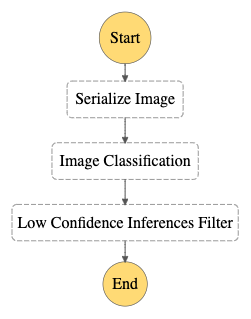

# Build-a-ML-Workflow-For-Scones-Unlimited-On-Amazon-SageMaker

## Project

### Overview
This project aimed to create and deploy an image classification model for Scones Unlimited using AWS SageMaker. Key components include a Jupyter notebook demonstrating the ML workflow, Lambda functions for tasks like data serialization and inference, and a Step Functions workflow to automate ML processes. The project utilizes Python 3, AWS Lambda functions, and Step Functions for workflow automation.

**1. `starter.ipynb`:** Jupyter notebook showcases a machine learning working workflow for Image Classification.
Step 1: Data staging
Step 2: Model training and deployment
Step 3: Lambdas and step function workflow
Step 4: Testing and evaluation
Step 5: Cleanup cloud resources
**2. `starter.html`:** Web-page displaying 'starter.ipynb'  
**3. `Lambda.py` script:** `compilation of the necessary 'lambda.py' scripts used by three AWS Lambda functions to create a Step Functions workflow`. (*Note: The 'lambda.py' file typically has a 'lambda_handler' function, which acts as the entry point for the Lambda function when it is triggered by an event such as an HTTP request or a scheduled cron job. This function takes an 'event' object, which contains information about the triggering event and a 'context' object, which contains information about the current execution environment. The 'lambda_handler' function is where the main logic of the Lambda function is executed, it can interact with other AWS services, perform calculations or process data. The function can also return a response to the service or client that triggered the Lambda function.)*  
**4. `stepfunctions_graph.png`:** screen capture of working step function.   

**5. `stepfunctions_json.json`:** Step Function exported to JSON 
